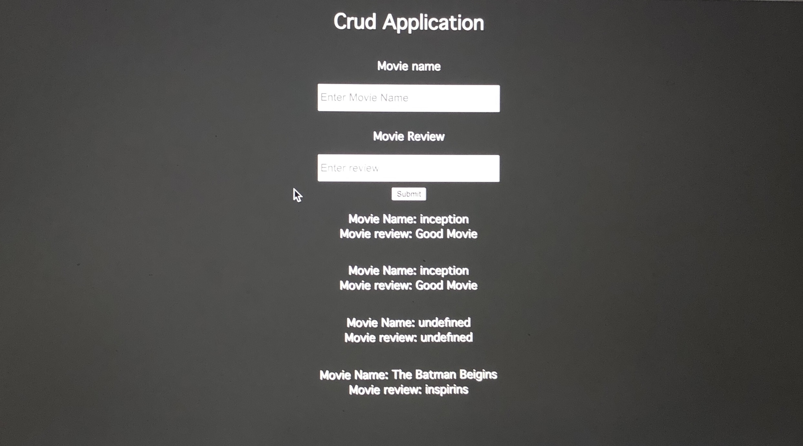

# Simple CRUD application
Simple CRUD Application with ReactJS, NodeJS, Express, and MySQL.

## Built with
- ReactJS
- NodeJS
- Express
- MySQL

## What I learned
- Here in this small project I learned how to fetch data from backend and put data in the backend.
- In front end I used ReactJS and made use of useEffect and useState hooks.

## Time taken
- It took me around 3 hours to built this Full stack Application from scratch.

  
## Contact me
- GitHub - [@RAM844](https://github.com/RAM844)
- Twitter - [@ShriramBalaji7](https://www.twitter.com/ShriramBalaji7)

## Screenshot

> Note: This Application is made while practicing Backend and not at all focused in frontend part and UI.
